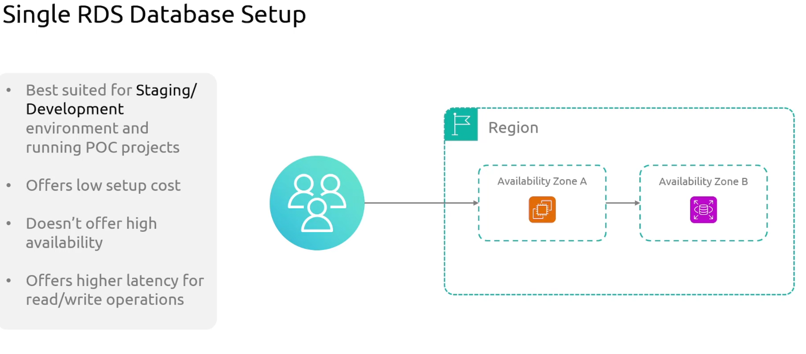
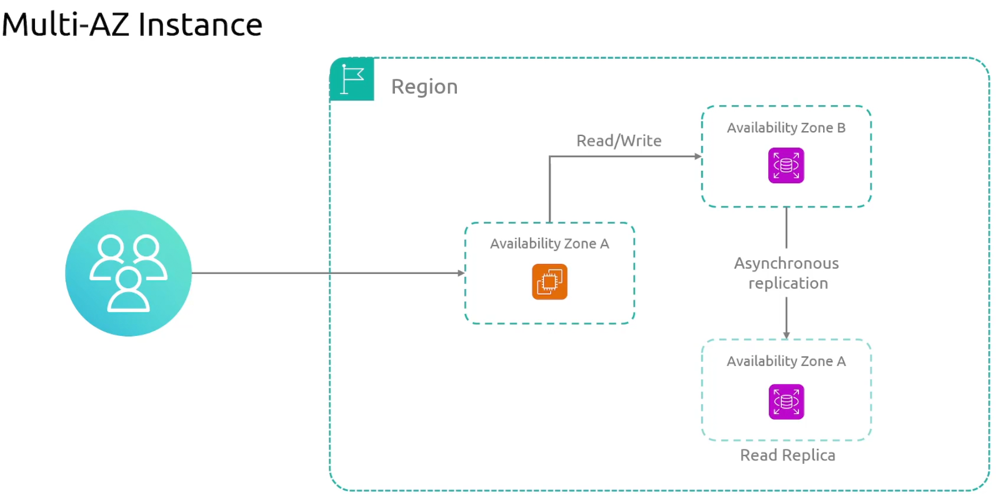
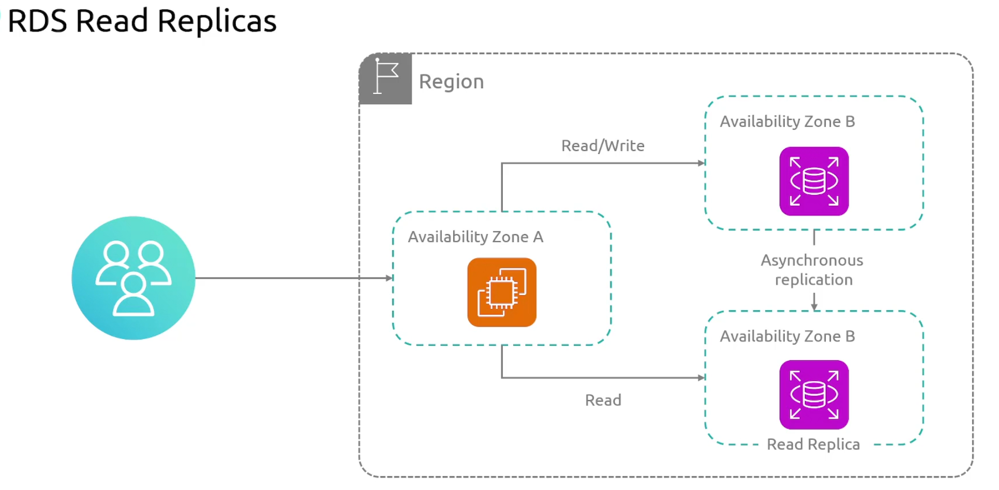
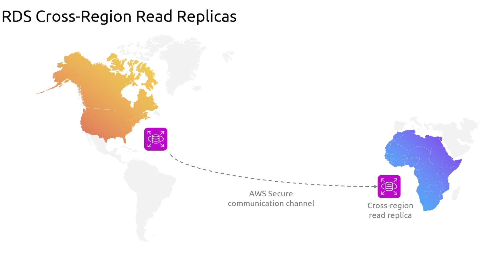
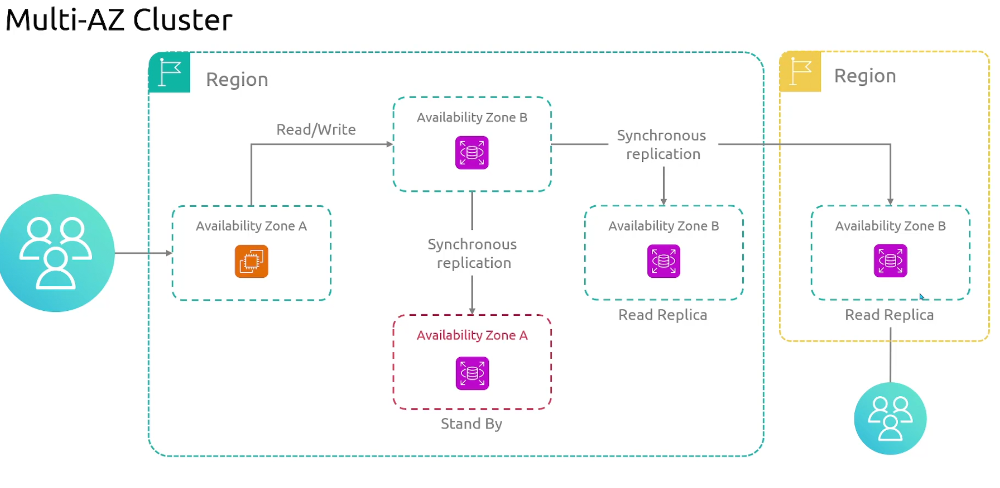
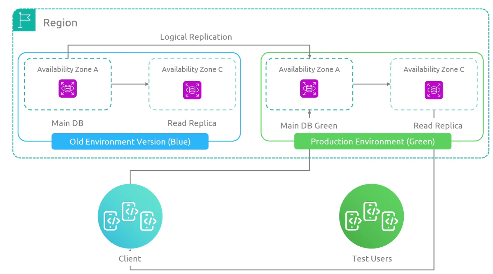

# AWS_SAA
Amazon Web Services - Solution Archtect Associate 

## RDS components 
    - MySql
    - PostgreSql 
    - MariaDB
    - Oracle
    - MicrosoftSQL server

## RDS instance types
    - General Purpose 
    - Memory optimized

## RDS deployment types
#### 1 Single RDS database setup
 - offer low setup cost 
 - doesn't offer hihg availability

--------------------------------------------------------------------

#### 2 Multi-AZ Deployment 

#### 3 Read Replicas

#### 4 Cross-region Read Replicas

#### 5 Multiaz Cluster

#### 6 blue-green 
